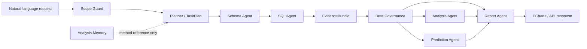

# AI Data Analyst

> Evidence-grounded multi-agent analytics for natural-language querying, operational analysis, prediction, and reporting.

[](https://www.python.org/)
[](https://langchain-ai.github.io/langgraph/)
[](https://fastapi.tiangolo.com/)
[](https://www.docker.com/)
[](#validated-results)

AI Data Analyst is a reproducible enterprise analytics platform built around LangGraph. It converts a natural-language request into a structured task plan, retrieves the relevant schema, generates and validates read-only SQL, invokes only the required analytics tools, and produces a report whose claims remain tied to executable evidence.

The project focuses on a practical reliability problem: an LLM may produce valid-looking SQL or fluent conclusions while selecting the wrong fields, using an incorrect business definition, or losing provenance between agents. The implementation addresses this with deterministic business semantics, schema grounding, fail-closed scope checks, bounded SQL repair, and a shared `EvidenceBundle`.

## Highlights

- **Question-driven orchestration** — `TaskPlan` selects only the agents and tools needed for the request instead of running a fixed pipeline.
- **Evidence-grounded output** — SQL, result rows, data-quality signals, model outputs, and limitations travel through a shared `EvidenceBundle`.
- **Reliable Text2SQL** — schema retrieval, deterministic field grounding, business metric contracts, result-shape validation, and bounded execution-feedback repair.
- **Read-only by design** — only one `SELECT` or `WITH` statement is accepted; writes, stored procedures, file export, and unsafe keywords are rejected.
- **Operational analytics** — RFM, K-Means segmentation, XGBoost churn scoring, and Prophet revenue forecasting with explicit baselines.
- **Safe memory reuse** — prior analyses can inform method selection without replacing current-query evidence.
- **Reproducible evaluation** — fixed test sets, paired ablations, per-sample artifacts, confidence intervals, McNemar tests, robustness checks, and concurrency tests.
- **Deployable service** — FastAPI, ECharts, MySQL, ChromaDB, and Docker Compose.

## System flow



The planner records the expected intent, required data, analysis or prediction tools, evidence requirements, and output form. Routing is conditional: a simple query can stop after SQL and governance, while a mixed request can continue through analysis, prediction, reporting, and chart generation.

## Reliability model

| Risk | Control |
|---|---|
| Wrong table or field | Schema RAG, deterministic field anchors, table ownership checks |
| Correct syntax but wrong business meaning | Query contracts define source, grain, formula, result columns, and ordering |
| Unsafe generated SQL | Single-statement read-only guard, keyword checks, timeout, and result-shape validation |
| Endless self-correction | Bounded retry count with every attempt and error recorded |
| Unsupported request | Scope Guard rejects out-of-domain tasks with a fail-closed response |
| Cross-agent evidence loss | `EvidenceBundle` is the explicit contract between nodes |
| Hallucinated report metrics | Report Agent may cite only facts present in the current evidence bundle |
| Stale or injected memory | Historical analyses are isolated from current facts and treated as method hints |

## Agents

| Component | Responsibility |
|---|---|
| **Planner Agent** | Classifies intent, builds the structured task plan, and controls conditional routing |
| **Schema Agent** | Retrieves and reranks relevant tables and fields from ChromaDB metadata |
| **SQL Agent** | Generates, validates, executes, and performs bounded repair of read-only SQL |
| **Governance Agent** | Scores runtime result quality and records source-table and missing-data limitations |
| **Analysis Agent** | Computes deterministic operational metrics, RFM features, and customer segments |
| **Prediction Agent** | Runs churn and revenue models together with comparable baselines |
| **Report Agent** | Converts the evidence bundle into a structured, limitation-aware business report |
| **Chart Renderer** | Produces ECharts-compatible visualization options from validated results |

## Technology stack

| Layer | Technologies |
|---|---|
| Orchestration | LangGraph, LangChain |
| Model access | OpenAI-compatible API client |
| Data and retrieval | MySQL, SQLAlchemy, ChromaDB, BAAI/bge-small-zh |
| Analytics | Pandas, scikit-learn, XGBoost, Prophet |
| Application | FastAPI, ECharts |
| Delivery | Docker, Docker Compose |
| Quality | Pytest, fixed evaluation sets, paired statistical tests |

## Quick start

### Option A: Docker Compose

Requirements: Docker with Compose support and an OpenAI-compatible LLM API key.

```bash
git clone https://github.com/lzh20050812/langgraph-data-analyst.git
cd langgraph-data-analyst
cp .env.example .env
```

Set the LLM values in `.env`, then start the stack:

```bash
docker compose -f docker/docker-compose.yml up -d --build
docker compose -f docker/docker-compose.yml ps
```

Open:

- Dashboard: <http://localhost:8000>
- Interactive API docs: <http://localhost:8000/docs>
- Health endpoint: <http://localhost:8000/health>

Stop the stack with:

```bash
docker compose -f docker/docker-compose.yml down
```

### Option B: Local Python

Requirements: Python 3.11 and a running MySQL 8 instance.

```bash
python -m venv .venv
```

Activate the environment and install dependencies:

```bash
# Windows PowerShell
.venv\Scripts\Activate.ps1

# macOS / Linux
source .venv/bin/activate

pip install -r requirements.txt
cp .env.example .env
```

Initialize the data and vector store, then start the API:

```bash
python -m storage.init_storage
uvicorn api.main:app --host 0.0.0.0 --port 8000
```

## Configuration

The application loads configuration from `.env`.

```env
# Any OpenAI-compatible provider
LLM_API_KEY=replace_with_your_api_key
LLM_API_BASE=https://api.deepseek.com/v1
LLM_MODEL=deepseek-chat

# MySQL
MYSQL_HOST=127.0.0.1
MYSQL_PORT=3306
MYSQL_USER=root
MYSQL_PASSWORD=analytics_dev_password
MYSQL_DATABASE=ai_analytics

# Retrieval and feature switches
CHROMA_PERSIST_DIR=./data/chromadb
EMBEDDING_MODEL=BAAI/bge-small-zh
BUSINESS_SEMANTICS_ENABLED=true
ANALYSIS_MEMORY_ENABLED=true
```

Never commit `.env` or an API key. The checked-in `.env.example` contains development-only placeholders; use a secret manager and a dedicated least-privilege database account in production.

## API usage

Submit a natural-language task:

```bash
curl -X POST http://localhost:8000/query \
  -H "Content-Type: application/json" \
  -d '{"query":"分析客户价值并预测流失风险"}'
```

An optional `intent` can force one of `sql_query`, `analysis`, `prediction`, or `mixed`:

```json
{
  "query": "比较不同客户群的价值并生成报告",
  "intent": "mixed"
}
```

Main endpoints:

| Method | Endpoint | Description |
|---|---|---|
| `GET` | `/health` | MySQL and LLM readiness |
| `POST` | `/query` | End-to-end query, analysis, prediction, and reporting |
| `GET` | `/charts` | ECharts options from the most recent request |
| `GET` | `/report` | Most recent evidence-grounded report |
| `GET` | `/docs` | OpenAPI documentation |

The `/query` response can include the detected intent, generated SQL, query rows, governance assessment, analysis output, prediction output, report, charts, execution messages, and a safe error description.

## Evaluation

Run the fast regression suite:

```bash
pip install -r requirements-dev.txt
pytest -q
```

Run individual evaluation entry points:

```bash
python -m evaluation.eval_schema
python -m evaluation.eval_sql
python -m evaluation.eval_prediction
python -m evaluation.eval_report
python -m evaluation.eval_summary
```

The formal harness in `evaluation/experiments/` covers data governance, retrieval, Text2SQL ablation, multi-agent routing, models, memory, robustness, runtime, and API concurrency. See [Benchmark methodology](docs/BENCHMARKS.md) and [SQL reliability optimization](docs/SQL_RELIABILITY_OPTIMIZATION.md).

<a id="validated-results"></a>
### Validated results

All figures below are bounded to the checked-in data snapshot and fixed evaluation sets; they are regression evidence, not open-domain performance claims.

| Area | Result | Interpretation |
|---|---:|---|
| Data governance | 1,176 missing cells and 604 duplicate issues repaired | 8,604 input records became 8,000 unique customers |
| Schema retrieval | BGE Field R@5 84.58%; character TF-IDF 90.00% | Negative result retained; vector retrieval was not overstated |
| Text2SQL | RAG execution accuracy 87.76%; full-schema 79.59% | 49 scorable tasks; McNemar `p=0.21875` |
| Business semantics ablation | Enabled 100%; disabled 46.67% | 15 paired tasks; McNemar `p=0.0078` |
| Multi-agent tasks | TCS 100%; SQL 100%; report quality 92.4/100 | Fixed 50-task suite |
| Customer segmentation | `k=2`; Silhouette 0.3105; ARI 0.997 | The initially assumed `k=4` was rejected by evaluation |
| Churn prediction | XGBoost AUC 0.6777; logistic AUC 0.6453 | Delta confidence interval crossed zero |
| Revenue forecasting | Prophet MAPE 15.65%; last-value baseline 14.36% | Prophet did not beat the strongest simple baseline |
| Analysis memory | R@1 80%; R@3 90%; MRR@3 0.85 | 10 memories and 10 paraphrased queries |
| Robustness | OOD 6/6 failed closed; injection 4/4 isolated | Core database row counts remained unchanged |
| API concurrency | 100% success at 1, 2, and 4 workers | Four-worker throughput: 1.392 req/s |
| Docker | MySQL and API healthy; `/health = ok` | End-to-end container deployment verified |

Current regression baseline: **32 tests passed**.

## Repository layout

```text
agents/                 LangGraph state, planning, grounding, agents, evidence, safety
api/                    FastAPI application and public endpoints
config/                 Environment settings and prompt templates
data/                   Small checked-in evaluation summaries; local datasets are ignored
docker/                 Docker Compose stack
docs/                   Benchmark and reliability documentation
etl/                    Deterministic field mapping, cleaning, deduplication, and loading
evaluation/             Fixed test sets, metrics, experiment harnesses, and summaries
frontend/               ECharts dashboard
scripts/                Data generation, metadata audit, and pipeline checks
storage/                MySQL adapter/schema and ChromaDB schema/memory stores
tests/                  Unit and contract regression tests
```

## Design notes

- Deterministic ETL owns source normalization and deduplication; the Governance Agent evaluates runtime query-result quality instead of mutating raw data.
- Stable, high-risk business metrics use deterministic query contracts. Open-ended requests still use Schema RAG and LLM generation.
- Model evaluation always includes simple or statistical baselines. A more complex model is not presented as better when it fails to beat them.
- ChromaDB stores schema metadata and reusable analysis memory in separate collections because they have different provenance and freshness rules.
- The default Docker database credentials are for local development only and should be replaced outside an isolated development environment.

## Limitations

- The bundled dataset models a bounded e-commerce domain; unsupported joins and capabilities are rejected rather than inferred.
- Text2SQL correctness still depends on schema coverage, registered business definitions, and provider behavior for open-ended queries.
- In-memory “latest report/charts” state is process-local and should be replaced by request-scoped persistence for multi-instance production deployments.
- The reported benchmarks are tied to one snapshot, model configuration, and fixed test sets.

## Contributing

1. Create a focused branch.
2. Add or update tests for behavioral changes.
3. Run `pytest -q` and the relevant evaluation module.
4. Keep per-sample evidence for metric changes and document negative results.
5. Do not commit secrets, large raw datasets, model caches, or local runtime artifacts.
