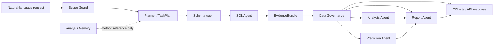
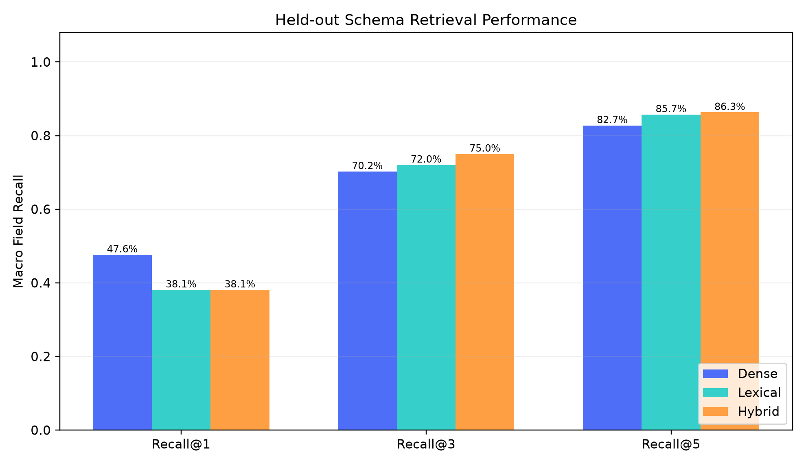
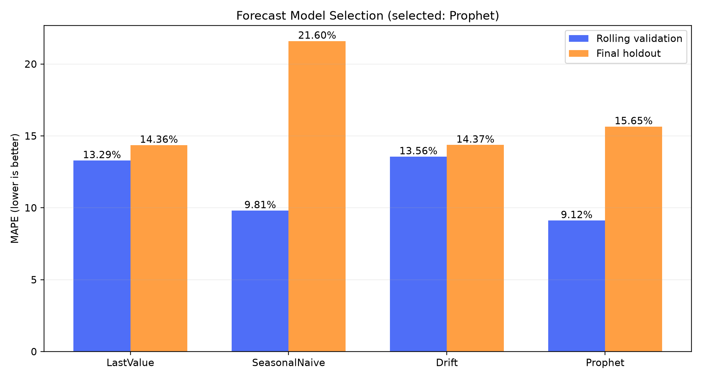

# AI Data Analyst

> Evidence-grounded multi-agent analytics for natural-language querying, operational analysis, prediction, and reporting.

[](https://www.python.org/)
[](https://langchain-ai.github.io/langgraph/)
[](https://fastapi.tiangolo.com/)
[](https://www.docker.com/)
[](#validated-results)
[](https://github.com/lzh20050812/langgraph-data-analyst/actions/workflows/ci.yml)

AI Data Analyst is a reproducible enterprise analytics platform built around LangGraph. It converts a natural-language request into a structured task plan, retrieves the relevant schema, generates and validates read-only SQL, invokes only the required analytics tools, and produces a report whose claims remain tied to executable evidence.

The project focuses on a practical reliability problem: an LLM may produce valid-looking SQL or fluent conclusions while selecting the wrong fields, using an incorrect business definition, or losing provenance between agents. The implementation addresses this with deterministic business semantics, schema grounding, fail-closed scope checks, bounded SQL repair, and a shared `EvidenceBundle`.

For the 2026-09-07 code-review findings, pending fixes, priorities, and acceptance criteria, see the [Optimization roadmap (中文)](README_OPTIMIZATION.md).

## Highlights

- **Question-driven orchestration** — `TaskPlan` selects only the agents and tools needed for the request instead of running a fixed pipeline.
- **Evidence-grounded output** — SQL, result rows, data-quality signals, model outputs, and limitations travel through a shared `EvidenceBundle`.
- **Reliable Text2SQL** — hybrid lexical/dense schema retrieval, deterministic field grounding, business metric contracts, result-shape validation, and bounded execution-feedback repair.
- **Read-only by design** — only one `SELECT` or `WITH` statement is accepted; writes, stored procedures, file export, and unsafe keywords are rejected.
- **Operational analytics** — RFM, K-Means segmentation, validation-based churn model selection, and holdout-based revenue model selection across Prophet and simple baselines.
- **Safe memory reuse** — prior analyses can inform method selection without replacing current-query evidence.
- **Reproducible evaluation** — fixed test sets, paired ablations, per-sample artifacts, confidence intervals, McNemar tests, robustness checks, and concurrency tests.
- **Deployable service** — FastAPI, ECharts, MySQL, ChromaDB, and Docker Compose.
- **Defense-ready portal** — authenticated multi-page UI, durable conversations, structured reports, evidence labels, and explicit offline demo scenarios.

## Explicit defense demo mode

Set `DEMO_MODE_ENABLED=true` (the local default) to expose five deterministic scenarios in the chat page, including the three core storylines: correct evidence-grounded analysis, multi-turn clarification, and Worker recovery. These scenarios are snapshots derived from the repository's fixed local dataset and are always labelled **cached demo results**. They create ordinary durable tasks, messages, and audit events, but do not invoke the LLM and must not be presented as live production analysis. Disable the endpoints with `DEMO_MODE_ENABLED=false`.

## System flow



The planner records the expected intent, required data, analysis or prediction tools, evidence requirements, and output form. Routing is conditional: a simple query reaches the generic chart renderer after SQL and governance, while a mixed request can continue through analysis, prediction, reporting, and specialist chart generation.

## Reliability model

| Risk | Control |
|---|---|
| Wrong table or field | Weighted lexical/dense schema retrieval, deterministic field anchors, table ownership checks |
| Correct syntax but wrong business meaning | Query contracts define source, grain, formula, result columns, and ordering |
| Unsafe generated SQL | Single-statement read-only guard, keyword checks, timeout, and result-shape validation |
| Endless self-correction | Bounded retry count with every attempt and error recorded |
| Unsupported request | Scope Guard rejects out-of-domain tasks with a fail-closed response |
| Cross-agent evidence loss | `EvidenceBundle` is the explicit contract between nodes |
| Hallucinated report metrics | Report Agent may cite only facts present in the current evidence bundle |
| Stale or injected memory | Historical analyses are isolated from current facts and treated as method hints |

## Agents

| Component | Responsibility |
|---|---|
| **Planner Agent** | Classifies intent, builds the structured task plan, and controls conditional routing |
| **Schema Agent** | Fuses lexical and ChromaDB rankings, then reranks relevant tables and fields |
| **SQL Agent** | Generates, validates, executes, and performs bounded repair of read-only SQL |
| **Governance Agent** | Scores runtime result quality and records source-table and missing-data limitations |
| **Analysis Agent** | Computes deterministic operational metrics, RFM features, and customer segments |
| **Prediction Agent** | Selects churn models by validation AUC and revenue models by holdout MAPE |
| **Report Agent** | Converts the evidence bundle into a structured, limitation-aware business report |
| **Chart Renderer** | Produces ECharts-compatible visualization options from validated results |

## Technology stack

| Layer | Technologies |
|---|---|
| Orchestration | LangGraph, LangChain |
| Model access | OpenAI-compatible API client |
| Data and retrieval | MySQL, SQLAlchemy, ChromaDB, BAAI/bge-small-zh |
| Analytics | Pandas, scikit-learn, XGBoost, Prophet |
| Application | FastAPI, ECharts |
| Delivery | Docker, Docker Compose |
| Quality | Pytest, fixed evaluation sets, paired statistical tests |

## Quick start

### Option A: Docker Compose

Requirements: Docker with Compose support and an OpenAI-compatible LLM API key.

```bash
git clone https://github.com/lzh20050812/langgraph-data-analyst.git
cd langgraph-data-analyst
cp .env.example .env
```

Set the LLM values in `.env`, then start the stack:

```bash
docker compose -p ai_analytics -f docker/docker-compose.yml up -d --build
docker compose -p ai_analytics -f docker/docker-compose.yml ps
```

On Windows, the complete build-and-smoke verification can be run with:

```powershell
powershell -ExecutionPolicy Bypass -File scripts/verify_docker_release.ps1
```

Use `-SkipBuild` for a quick check of an already-built image.

Open:

- Dashboard: <http://localhost:8000>
- Interactive API docs: <http://localhost:8000/docs>
- Liveness endpoint: <http://localhost:8000/health/live>
- Readiness endpoint: <http://localhost:8000/health/ready>

Stop the stack with:

```bash
docker compose -p ai_analytics -f docker/docker-compose.yml down
```

### Option B: Local Python

Requirements: Python 3.11 and a running MySQL 8 instance.

On Windows, after the environment and database are ready, double-click
`启动平台.bat`. It starts the local API without Docker and opens
<http://127.0.0.1:8000>. The browser portal now provides authenticated pages
for conversations, data catalog, durable tasks, operations, audit logs, and
user management. The former single-file dashboard remains available at
<http://127.0.0.1:8000/legacy> as an offline-friendly fallback.

The first local run creates the administrator configured by
`INITIAL_ADMIN_USERNAME` and `INITIAL_ADMIN_PASSWORD` (development defaults:
`admin` / `Admin123!`). Change the password in `.env` before a public demo or
deployment; passwords are scrypt-hashed and browser sessions use an HttpOnly
cookie.

For a defense presentation, double-click `答辩演示.bat`. It opens the live
operations dashboard first so health, task reliability, the seven-stage Agent
flow, Worker state, tenant quotas, and audit evidence are visible before the
interactive query demonstration. Follow
[`docs/DEFENSE_DEMO.md`](docs/DEFENSE_DEMO.md) for the five-minute script and
offline fallback checklist.

```bash
python -m venv .venv
```

Activate the environment and install dependencies:

```bash
# Windows PowerShell
.venv\Scripts\Activate.ps1

# macOS / Linux
source .venv/bin/activate

pip install -r requirements.txt
cp .env.example .env
```

Initialize the data and vector store, then start the API:

```bash
python -m storage.init_storage
uvicorn api.main:app --host 0.0.0.0 --port 8000
```

## Configuration

The application loads configuration from `.env`. Direct Python dependencies are exactly pinned; see [Dependency reproducibility policy](docs/DEPENDENCY_POLICY.md) for the verified platforms and update procedure.

```env
# Any OpenAI-compatible provider
LLM_API_KEY=replace_with_your_api_key
LLM_API_BASE=https://api.deepseek.com/v1
LLM_MODEL=deepseek-chat

# MySQL
MYSQL_HOST=127.0.0.1
MYSQL_PORT=3306
MYSQL_USER=root
MYSQL_PASSWORD=analytics_dev_password
MYSQL_DATABASE=ai_analytics

# Retrieval and feature switches
CHROMA_PERSIST_DIR=./data/chromadb
EMBEDDING_MODEL=BAAI/bge-small-zh
BUSINESS_SEMANTICS_ENABLED=true
ANALYSIS_MEMORY_ENABLED=true

# Browser login (replace the development password)
WEB_LOGIN_ENABLED=true
LOCAL_ACCESS_ENABLED=false
SESSION_COOKIE_SECURE=false
INITIAL_ADMIN_USERNAME=admin
INITIAL_ADMIN_PASSWORD=replace_with_a_strong_password
```

Never commit `.env` or an API key. The checked-in `.env.example` contains development-only placeholders; use a secret manager and a dedicated least-privilege database account in production.

`LOCAL_ACCESS_ENABLED=true` is an explicit single-user development bypass. Keep it disabled whenever browser login or API-key authentication is used; disabling API-key authentication alone never grants administrator identity.

## API usage

The dashboard uses the durable asynchronous task API. Submit a task:

```bash
curl -X POST http://localhost:8000/tasks \
  -H "Content-Type: application/json" \
  -d '{"query":"分析客户价值并预测流失风险"}'
```

The response contains a task ID plus status and SSE event URLs. `GET
/tasks/{task_id}/events` streams planner, schema, SQL, governance, analysis,
prediction, report, and chart progress. Completed results remain available from
`GET /tasks/{task_id}` after a browser refresh or API process restart. The
synchronous compatibility endpoint remains available:

```bash
curl -X POST http://localhost:8000/query \
  -H "Content-Type: application/json" \
  -d '{"query":"分析客户价值并预测流失风险"}'
```

An optional `intent` can force one of `sql_query`, `analysis`, `prediction`, or `mixed`. Queries are trimmed and limited to 1,000 characters at the API boundary:

```json
{
  "query": "比较不同客户群的价值并生成报告",
  "intent": "mixed"
}
```

Main endpoints:

| Method | Endpoint | Description |
|---|---|---|
| `GET` | `/health/live` | Process liveness without dependency calls |
| `GET` | `/health/ready` | MySQL connectivity and LLM configuration readiness |
| `GET` | `/health` | Backward-compatible readiness alias |
| `GET` | `/auth/me` | Return the authenticated subject and role |
| `POST` | `/tasks` | Queue a durable background analysis task |
| `GET` | `/tasks` | List recent tasks and lifecycle states |
| `GET` | `/tasks/{task_id}` | Read task status and final result |
| `DELETE` | `/tasks/{task_id}` | Request cooperative cancellation |
| `GET` | `/tasks/{task_id}/events` | Stream durable progress events over SSE |
| `GET` | `/tasks/{task_id}/checkpoint` | Inspect the latest node checkpoint |
| `POST` | `/tasks/{task_id}/retry?mode=restart` | Restart a terminal/interrupted task with duplicate-execution warning; unsafe checkpoint continuation is rejected |
| `GET` | `/operations/summary` | Read aggregate task runtime metrics |
| `GET` | `/operations/metrics` | Prometheus-compatible runtime metrics |
| `GET` | `/operations/workers` | Admin-only active worker inventory |
| `GET` | `/operations/audit` | Admin-only durable mutation audit trail |
| `GET` | `/operations/rate-limits` | Admin-only active tenant quota windows |
| `GET` | `/operations/preflight` | Admin-only read-only defense readiness checklist |
| `POST` | `/query` | Synchronous backward-compatible workflow |
| `GET` | `/charts/{request_id}` | ECharts options for one request |
| `GET` | `/report/{request_id}` | Evidence-grounded report for one request |
| `GET` | `/docs` | OpenAPI documentation |

Every HTTP response includes server-generated `X-Request-ID` and `X-Process-Time-Ms` headers. The `/query` body repeats the same `request_id` and can include the detected intent, generated SQL, query rows, governance assessment, analysis output, prediction output, report, charts, execution messages, and a safe error description. Use the request ID to retrieve the matching report or charts and correlate structured server logs without cross-request state leakage. Expensive queries are limited to four concurrent executions by default; excess requests receive HTTP 429 with `Retry-After`.

Task plans and evidence bundles are validated with Pydantic contracts. Every
workflow node records duration and status, while LLM calls emit model, latency,
and token-usage events without logging prompts or API keys. SQLite provides the
zero-service local task store; its interface is intentionally isolated so a
multi-host deployment can replace it with Redis/PostgreSQL. See
[architecture upgrade notes](docs/ARCHITECTURE_UPGRADE.md).

Set `API_AUTH_ENABLED=true` and provide one or more comma-separated `API_KEYS`
to protect analysis, task, report, chart, and operations endpoints. The
dashboard requests a key only after HTTP 401 and keeps it in browser session
storage rather than persistent local storage. Health and dashboard assets stay
public so deployment probes and the access prompt can load.

For identity-aware isolation, prefer `API_PRINCIPALS_JSON`:

```json
[
  {"id":"analyst-a","role":"analyst","key":"replace-me"},
  {"id":"operations-admin","role":"admin","key":"replace-me-too"}
]
```

Analysts can access only their own tasks, events, checkpoints, reports, charts,
and metrics. Administrators receive a global view. Legacy `API_KEYS` remain
supported and are mapped to separate analyst identities using non-secret key
fingerprints.

Clients may attach `Idempotency-Key` to `POST /tasks`. Repeating the same key,
tenant, and request body returns the original task instead of executing the
analysis twice; reusing the key with different content fails with HTTP 409.
The dashboard retains this key across uncertain network retries. Task submit,
retry, and cancellation mutations are written to a bounded durable audit trail
without prompts, API keys, or raw idempotency-key values.

Expensive submission traffic is protected by a SQLite-backed fixed-window
budget shared across API processes. `/query` and `/tasks` consume the same
per-tenant allowance and return `X-RateLimit-Limit`, `X-RateLimit-Remaining`,
and `X-RateLimit-Reset`; rejected requests return HTTP 429 with `Retry-After`.
Set `API_RATE_LIMIT_REQUESTS=0` only for a trusted local environment.

Task execution has two deployment modes. `embedded` keeps the zero-setup local
experience by running a bounded executor inside the API process. `external`
stores queued work durably and lets one or more `python -m api.task_worker`
processes claim tasks atomically. Workers renew leases while a node is running;
expired work is requeued up to `TASK_WORKER_MAX_ATTEMPTS`. Docker Compose uses
the external mode and starts a dedicated worker container.

## Evaluation

Run the fast regression suite:

```bash
pip install -r requirements-dev.txt
pytest -q
```

Run individual evaluation entry points:

```bash
python -m evaluation.eval_schema
python -m evaluation.eval_sql
python -m evaluation.eval_prediction
python -m evaluation.eval_report
python -m evaluation.eval_summary
```

The formal harness in `evaluation/experiments/` covers data governance, retrieval, Text2SQL ablation, multi-agent routing, models, memory, robustness, runtime, and API concurrency. See [Benchmark methodology](docs/BENCHMARKS.md) and [SQL reliability optimization](docs/SQL_RELIABILITY_OPTIMIZATION.md).

Post-freeze optimization entry points keep validation samples separate from final test samples:

```bash
python -m evaluation.experiments.hybrid_schema_evaluation
python -m evaluation.experiments.prediction_selection_evaluation
python -m evaluation.experiments.stage5_deterministic_regression --check
python -m evaluation.experiments.architecture_comparison_v2  # dry-run; paid execution is explicitly gated
```

<a id="validated-results"></a>
### Validated results

All figures below are bounded to the checked-in data snapshot and fixed evaluation sets; they are regression evidence, not open-domain performance claims. The machine-readable source of truth is [`evaluation/final_results/final_metrics.json`](evaluation/final_results/final_metrics.json); older `data/processed/eval_*.json` files are retained only as legacy development evidence.

| Area | Result | Interpretation |
|---|---:|---|
| Data governance | 1,176 missing cells and 604 duplicate issues repaired | 8,604 input records became 8,000 unique customers |
| Schema retrieval | BGE Field R@5 84.58%; character TF-IDF 90.00% | Negative result retained; vector retrieval was not overstated |
| Text2SQL | RAG execution accuracy 87.76%; full-schema 79.59% | 49 scorable tasks; McNemar `p=0.21875` |
| Business semantics ablation | Enabled 100%; disabled 46.67% | 15 paired tasks; McNemar `p=0.0078` |
| Multi-agent tasks | TCS 100%; SQL 100%; report quality 92.4/100 | Fixed 50-task suite |
| Customer segmentation | `k=2`; Silhouette 0.3105; ARI 0.997 | The initially assumed `k=4` was rejected by evaluation |
| Churn prediction | XGBoost AUC 0.6777; logistic AUC 0.6453 | Delta confidence interval crossed zero |
| Revenue forecasting | Prophet MAPE 15.65%; last-value baseline 14.36% | Prophet did not beat the strongest simple baseline |
| Analysis memory | R@1 80%; R@3 90%; MRR@3 0.85 | 10 memories and 10 paraphrased queries |
| Robustness | OOD 6/6 failed closed; injection 4/4 isolated | Core database row counts remained unchanged |
| API concurrency | 100% success at 1, 2, and 4 workers | Four-worker throughput: 1.392 req/s |
| Docker | MySQL, API, and Worker healthy; `db-init` exited 0 | Worker restart count remained 0 while the full release suite ran |

Current local regression baseline (2026-09-20): **221 tests passed**. See the [upgrade progress record](docs/UPGRADE_PROGRESS.md) for commands, environment, and remaining verification boundaries. The frozen final-metrics record still contains the earlier **55 tests passed** regression snapshot, while the 2026-08-12 experiment pack recorded the 32-test baseline that existed at the time.

#### Post-freeze held-out optimization (2026-08-25)

These results are stored separately and do not overwrite the frozen thesis baseline:

- Hybrid Schema retrieval used 12 validation questions to select `vector=0.2`, `lexical=0.8`, `RRF k=20`, then evaluated once on 28 held-out questions. Test Field R@5 was 82.74% for dense, 85.71% for lexical, and 86.31% for hybrid. Hybrid's +0.60 percentage-point delta over lexical had a bootstrap 95% CI of `[-3.57, 5.36]` points, so it is retained as a small, not statistically reliable improvement.
- Revenue model selection used three rolling-origin validation folds. Prophet had the best mean validation MAPE at 9.12% and was selected without looking at the final six months. On that independent holdout it reached 15.65%, while LastValue reached 14.36%; this negative generalization result is preserved rather than using the test set to reselect the model.
- After the independent audit, the validation-selected forecasting model is refitted on all observed history for actual future predictions.





#### Docker validation evidence

The current release was rebuilt and verified on 2026-09-20 with
`scripts/verify_docker_release.ps1`: MySQL, API, and Worker became healthy,
`db-init` exited 0, the Worker restart count stayed 0, and the live, ready, and
frontend HTTP checks passed. The full 221-test release verification then ran
while the containers stayed healthy. API and Worker share a Docker named volume
for SQLite WAL; pytest uses a separate session-scoped temporary database. The
local and container Python environments pass `pip check`, and the containers do
not expose `/app/.env` as a file.

The earlier 2026-08-18 end-to-end probe additionally verified:

- `docker compose -p ai_analytics -f docker/docker-compose.yml ps -a` reported `mysql` and `app` as healthy and the one-shot `db-init` service as exited 0.
- `GET /health/live` returned `ok`; `/health/ready` returned `ok` with MySQL `connected` and LLM `configured`.
- The API connected as `analytics_reader@%`; MySQL grants were limited to `USAGE` and `SELECT` on `ai_analytics.*`.
- Response `X-Request-ID` and `X-Process-Time-Ms` headers matched the structured Docker stdout request log.
- A five-request overload probe admitted four queries and rejected one in 52 ms with HTTP 429 and `Retry-After: 2`.
- Container MySQL row counts were `customers=8000`, `orders=25000`, `monthly_revenue=75`, and `product_summary=140`.
- `POST /query` with `{"query":"分析会员等级分布","intent":"sql_query"}` succeeded with 4 result rows and no error; the returned `request_id` matched both result-scoped retrieval endpoints.

## Repository layout

```text
agents/                 LangGraph state, planning, grounding, agents, evidence, safety
api/                    FastAPI application and public endpoints
config/                 Environment settings and prompt templates
data/                   Small checked-in evaluation summaries; local datasets are ignored
docker/                 Docker Compose stack
docs/                   Benchmark and reliability documentation
etl/                    Deterministic field mapping, cleaning, deduplication, and loading
evaluation/             Fixed test sets, metrics, experiment harnesses, and summaries
frontend/               ECharts dashboard
scripts/                Data generation, metadata audit, and pipeline checks
storage/                MySQL adapter/schema and ChromaDB schema/memory stores
tests/                  Unit and contract regression tests
```

## Design notes

- Deterministic ETL owns source normalization and deduplication; the Governance Agent evaluates runtime query-result quality instead of mutating raw data.
- Stable, high-risk business metrics use deterministic query contracts. Open-ended requests use weighted lexical/dense Schema retrieval and LLM generation.
- Runtime prediction selects among explicit candidates using held-out data; the frozen benchmark tables continue to report each model separately for reproducibility.
- Model evaluation always includes simple or statistical baselines. A more complex model is not presented as better when it fails to beat them.
- ChromaDB stores schema metadata and reusable analysis memory in separate collections because they have different provenance and freshness rules.
- The default Docker database credentials are for local development only and should be replaced outside an isolated development environment.

## Limitations

- The bundled dataset models a bounded e-commerce domain; unsupported joins and capabilities are rejected rather than inferred.
- Text2SQL correctness still depends on schema coverage, registered business definitions, and provider behavior for open-ended queries.
- Synchronous request results remain in a bounded process-local store. Durable asynchronous task state uses SQLite WAL with fenced leases on one host; multi-host deployment requires a shared transactional metadata store, with PostgreSQL as the documented migration target.
- The reported benchmarks are tied to one snapshot, model configuration, and fixed test sets.

## Contributing

1. Create a focused branch.
2. Add or update tests for behavioral changes.
3. Run `pytest -q` and the relevant evaluation module.
4. Keep per-sample evidence for metric changes and document negative results.
5. Do not commit secrets, large raw datasets, model caches, or local runtime artifacts.
