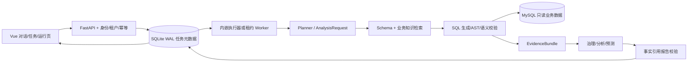

# AI Data Analyst 最终交付说明

> 交付版本：`2026.09`；代码状态：阶段一至阶段七可执行部分；日期：2026-09-19。

## 项目定位

面向业务数据的可信多轮分析 Agent 平台：把自然语言请求转换为结构化分析条件，检索 Schema 与业务口径，安全执行只读 SQL，输出带事实引用的分析报告，并在重复提交、断连和 Worker 中断时维持正确任务归属。

## 当前架构



SQLite 是单主机任务真相源，MySQL 是业务数据源，ChromaDB 保存 Schema/业务知识和隔离的分析记忆。多主机不共享 SQLite；迁移触发条件及组件取舍见 `CAPACITY_REPORT.md`。

## 一键运行与验证

Windows 本地演示：双击根目录 `答辩演示.bat`。Docker 运行：

```powershell
Copy-Item .env.example .env
docker compose -p ai_analytics -f docker/docker-compose.yml up -d --build
docker compose -p ai_analytics -f docker/docker-compose.yml ps
```

确定性验收：

```powershell
.\.venv\Scripts\python.exe -m pytest -q
.\.venv\Scripts\python.exe -m evaluation.experiments.stage5_deterministic_regression --check
Set-Location frontend
npm run typecheck
npm run build
```

也可一次执行 `powershell -ExecutionPolicy Bypass -File scripts/verify_release.ps1`；该脚本不会运行付费模型评测。

付费架构对照默认只 dry-run；必须显式确认模型、样本、调用、Token 与美元上限才能执行。

## 三个完整演示

1. **正确分析与证据链**：选择“品类经营表现”，依次展示结构化条件、只读 SQL、结果、事实来源和限制。
2. **多轮澄清**：选择“多轮澄清与条件继承”，展示年份/国家继承、分组替换，以及净销售额因缺少退款字段而拒绝编造。
3. **故障恢复**：选择“Worker 中断与租约接管”，展示 `queued → running → queued → running → completed`、新旧执行者和唯一终态。页面明确说明这是确定性故障演示；真实行为由自动化故障测试验证。

每个缓存场景都显示“固定数据集缓存 · 不调用 LLM”。用户现场输入产生的结果显示“实时 Agent 分析”。二者不得混述。

## 证据索引

| 结论 | 可核验证据 |
|---|---|
| 当前本地回归 | `docs/UPGRADE_PROGRESS.md` |
| 179 条版本化评测目录 | `evaluation/data/benchmark_catalog_v2026_09.json` |
| 31 条无模型 CI 记录 | `evaluation/optimization_results/stage5_20260918/` |
| 同模型三架构小样本 | `evaluation/results/architecture_comparison_v2/20260918_160657/` |
| 容量与组件边界 | `docs/CAPACITY_REPORT.md` |
| 运行恢复方式 | `docs/RUNTIME_RECOVERY.md` |
| 关键设计取舍 | `docs/KEY_DESIGN_DECISIONS.md` |

## 现场演示走查（建议 6 分钟）

- 00:00–00:40：运行监控与预检；说明真实健康状态、Worker 和预算。
- 00:40–02:10：正确分析缓存场景；强调缓存标签，展开 SQL、证据与限制。
- 02:10–03:30：多轮澄清场景；逐轮解释继承、替换与拒绝。
- 03:30–04:40：故障恢复场景；展示状态时间线，再进入任务详情查看 Trace ID。
- 04:40–05:30：现场提交一个实时问题，指出实时标签与 SSE 节点进度。
- 05:30–06:00：展示评测边界和负结果，不宣称生产用户或开放域准确率。

现场演示前隐藏 `.env`、终端历史和任何密钥，使用新建演示账号并先跑预检。用户已确认不需要录制视频文件；本走查仅用于现场展示准备。

## 可核验简历表述

> 设计并实现基于 FastAPI、LangGraph、MySQL 与 ChromaDB 的可信多轮数据分析 Agent，将指标口径、Schema 检索、只读 Text2SQL、EvidenceBundle 与事实引用报告串成受控工作流；构建 179 条版本化评测目录和确定性 CI，当前本地回归 217 项通过。

> 为异步分析任务实现 SQLite WAL 状态机、幂等提交、租约和执行令牌 fencing，覆盖 Worker 中断/接管、迟到写入、取消和 SSE 重连；明确单主机边界，并以容量证据决定暂不引入 Redis/消息队列。

> 在固定 Flash 模型、统一数据和预算的 5 题/架构小样本中，受控工作流严格结果等价 5/5，直接 SQL 与单 Agent 均为 0/5；该结果仅代表已知模板，不外推开放式 Text2SQL。

禁止改写为“服务真实生产用户”“开放域准确率 100%”“分布式生产 SLA”或“模型方案统计显著优于所有基线”。

## 未完成和外部边界

- 检查点任意节点续跑仍被安全拒绝。
- 未进行多主机、真实模型高并发或完整 50 题付费架构对照。
- 实际公开部署需要 TLS、外部身份系统、密钥管理和共享事务型任务存储。
