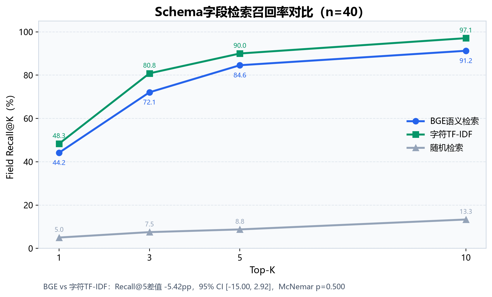
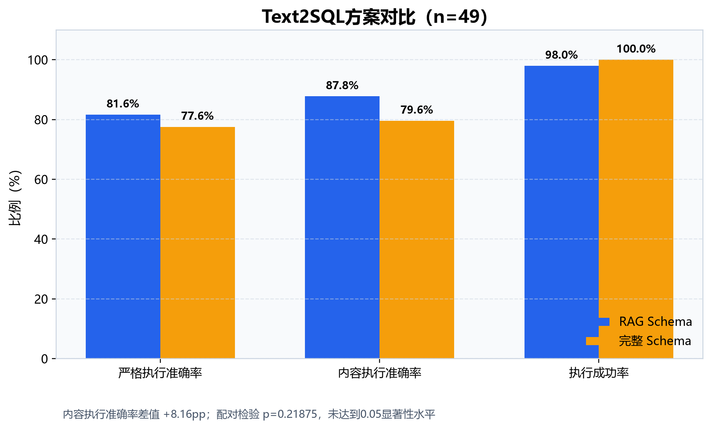
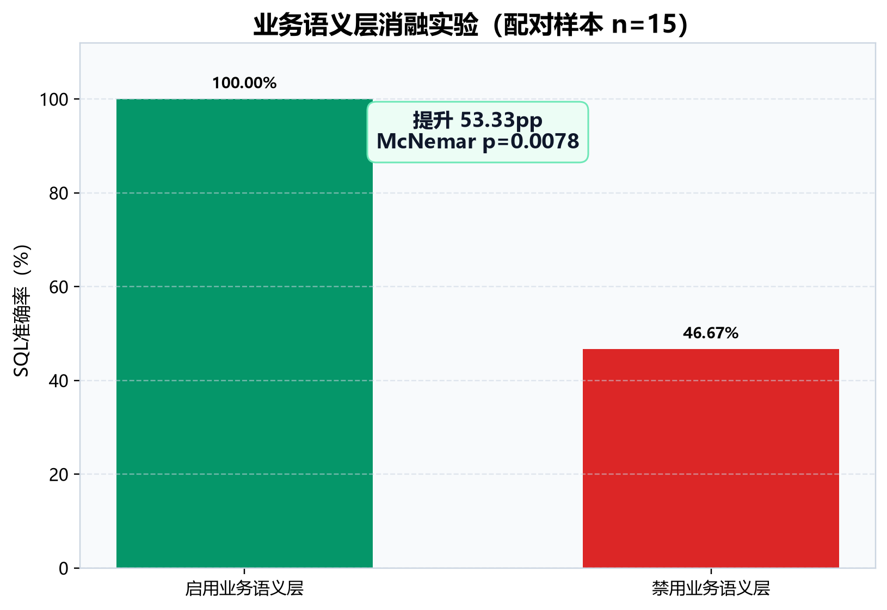
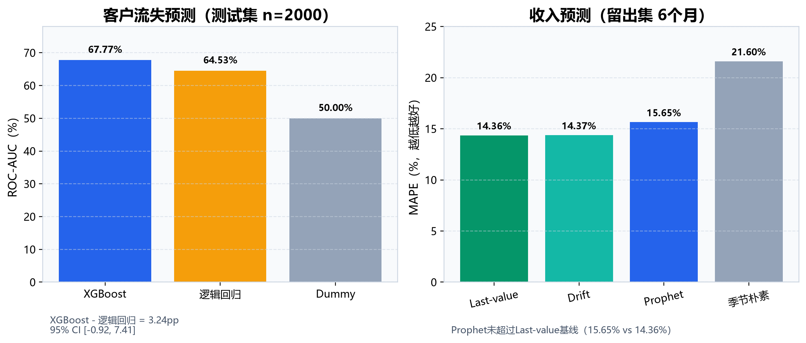
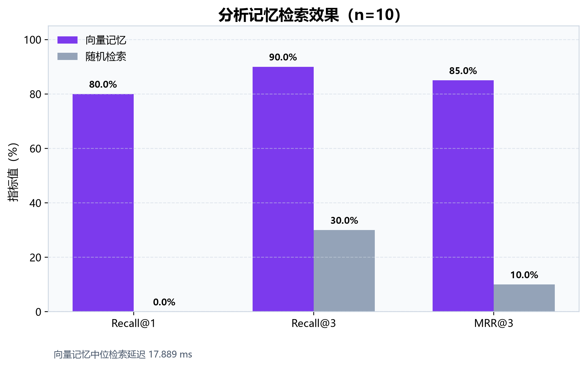
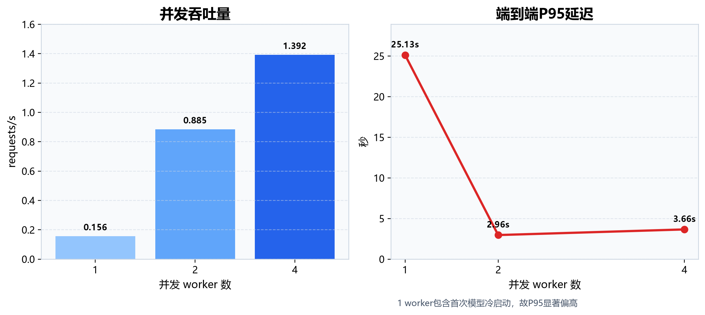

# 第六章 实验设计与结果分析（最终口径）

> 本章数据冻结于2026年8月12日，来源提交为 `e9b8cc86dbe0cf23710f02891be4be686c0bc680`。所有结论均限定于本项目的固定数据快照和固定测试集，不应外推为开放域性能。机器可读的唯一指标源为 `evaluation/final_results/final_metrics.json`，来源文件及SHA-256校验值记录在 `evaluation/final_results/source_manifest.json`。

## 6.1 实验目标与研究问题

本章从数据治理、Schema检索、Text2SQL、多智能体协同、预测模型、分析记忆、系统性能与安全鲁棒性八个方面验证系统。与仅展示若干成功案例相比，固定测试集、成对对照和显著性检验能够更可靠地回答系统“是否有效”“由什么组件带来提升”以及“在哪些边界上仍然不足”。围绕上述目标，设置以下研究问题：

- **RQ1：数据治理链路是否能够稳定修复异构数据中的缺失、重复和格式问题，同时保留原始客户实体？**
- **RQ2：BGE语义检索能否优于轻量词法检索，RAG Schema能否提高Text2SQL执行准确率？**
- **RQ3：多智能体系统能否在固定业务任务集上完成端到端执行，业务语义层是否具有独立贡献？**
- **RQ4：客户分群、流失预测、收入预测和分析记忆是否达到可解释、可复现的效果？**
- **RQ5：系统在并发、越权SQL、提示注入和超出数据能力范围的请求下是否保持稳定与安全？**

实验不预设所有复杂方法都必须优于简单基线。例如，语义检索未必优于字符TF-IDF，Prophet也未必优于last-value预测。对未达到显著性或未超过基线的结果如实报告，是本章分析的重要组成部分。

## 6.2 实验环境与数据基础

### 6.2.1 软件与运行环境

本地开发与验证环境为Windows、Python 3.12；Docker和CI目标环境为Linux amd64、Python 3.11。主要直接依赖均采用精确版本固定，核心版本如表6-1所示。正式实验调用OpenAI兼容接口下的 `deepseek-chat`，SQL生成温度设为0，以降低随机性。Embedding采用 `BAAI/bge-small-zh`，在本地CPU环境运行。Docker中的MySQL版本为8.0。

| 组件 | 版本或配置 | 主要用途 |
|---|---|---|
| Python | 本地3.12；Docker/CI 3.11 | 系统开发与实验运行 |
| LangGraph | 1.2.10 | 多智能体状态图编排 |
| LangChain | 1.3.14 | 模型与工具调用抽象 |
| OpenAI SDK | 2.53.0 | OpenAI兼容LLM接口 |
| ChromaDB | 1.5.9 | Schema与分析记忆向量检索 |
| SQLAlchemy / PyMySQL | 2.0.51 / 1.2.0 | MySQL访问 |
| pandas / NumPy | 3.0.5 / 2.5.2（本地） | 数据处理与数值计算 |
| scikit-learn / XGBoost | 1.9.0 / 3.4.0（本地） | 分群与流失预测 |
| Prophet | 1.3.0 | 月度收入预测 |
| MySQL | 8.0 | 业务数据存储 |

**表6-1 实验软件环境**

硬件不是本研究的自变量，本文不以某一显卡或特定CPU的绝对延迟作为主要结论。涉及性能的数据均报告样本数、并发条件和冷启动影响，避免将单机测量误写为通用性能保证。

### 6.2.2 数据集与数据库快照

实验数据为固定的模拟电商业务快照，运行数据库包含4张核心表：8,000条客户记录、25,000条订单记录、75条月度收入记录和140条商品汇总记录。数据治理实验从App端和Web端两个异构来源开始，共输入8,604行原始客户数据；合并去重后的唯一客户数为8,000。

| 表名 | 行数 | 主要内容 |
|---|---:|---|
| `customers` | 8,000 | 客户属性、价值、活跃度与流失标签 |
| `orders` | 25,000 | 订单金额、品类、渠道、支付与履约信息 |
| `monthly_revenue` | 75 | 月度营收、订单量与客户指标 |
| `product_summary` | 140 | 商品销售、退货和评分汇总 |

**表6-2 固定数据库快照**

### 6.2.3 可复现性控制

正式结果采用“三层冻结”方式管理：第一层是 `final_metrics.json` 中的论文指标；第二层是 `source_manifest.json` 中12个来源文件的路径与SHA-256；第三层是保留在 `evaluation/results/` 下的逐实验输出。冻结日期与代码回归日期分开记录：正式实验冻结于2026年8月12日，而55项代码测试的回归基线验证于2026年8月18日，二者不混为同一实验口径。

## 6.3 实验任务与评价指标

### 6.3.1 数据治理实验

数据治理实验检查字段映射、缺失值填补、源内重复和跨源重叠消除、性别与日期格式规范化，以及清洗后客户ID保留率。核心指标包括缺失问题修复率、重复问题修复率、ID召回率和重复运行耗时。

### 6.3.2 Schema检索实验

Schema检索测试集包含40个自然语言问题和67个候选字段。对比方法包括BGE稠密向量检索、字符TF-IDF词法检索和随机检索。主要指标为字段宏平均Recall@K、Precision@K、Hit@K、表级Recall@K、MRR@10和检索延迟。

为避免只比较平均值，BGE与词法检索的Recall@5进一步计算成对Bootstrap 95%置信区间，并用精确McNemar检验比较两种方法在问题级命中上的差异。显著性水平设为0.05。

### 6.3.3 Text2SQL实验

Text2SQL实验包含49个可评分问题，对比两种Schema供给方式：

1. **RAG Schema**：由检索模块返回与问题最相关的表和字段；
2. **完整Schema**：将全部Schema作为上下文提供给模型。

主要指标包括：严格执行准确率（结果值、列结构与顺序均满足标准）、内容执行准确率（忽略非语义性的行列顺序差异）、SQL执行成功率、初始内容执行准确率以及自修正恢复数量。RAG与完整Schema使用配对检验，检验其内容执行准确率差异。

### 6.3.4 多智能体端到端实验与消融实验

固定多智能体测试集共50题，包括15题SQL查询、15题业务分析、10题预测和10题综合任务。任务完成率要求系统完成相应路由链并返回符合契约的实际结果，而不是只要生成文本即判为成功。SQL准确率按可验证结果与标准答案比对，报告质量在10个综合报告样本上按结构、数据支撑和业务建议评分。

业务语义层消融实验从高风险SQL问题中构造15个成对样本，仅切换语义规则是否启用，其他系统配置保持一致。该实验以SQL准确率为主指标，并使用精确McNemar检验判断差异是否显著。

### 6.3.5 分析、预测与记忆实验

客户分析使用8,000个样本进行RFM分群，通过轮廓系数选择聚类数，并用不同随机种子的调整兰德指数（ARI）评价稳定性。流失预测按4,800/1,200/2,000划分训练集、验证集和测试集，比较XGBoost、逻辑回归与Dummy分类器，主指标为ROC-AUC；XGBoost与逻辑回归的差值使用Bootstrap 95%置信区间。

收入预测使用69个月训练、6个月留出测试，比较Prophet、季节朴素、last-value和drift四种方法，以MAPE为主指标。分析记忆使用10条种子记忆和10个改写查询，对比向量检索与固定随机检索，报告Recall@1、Recall@3、MRR@3和延迟。

### 6.3.6 鲁棒性与系统实验

鲁棒性测试包含6个超出Schema能力的问题和4个提示注入问题。前者要求系统明确拒绝或安全失败，后者要求最终SQL保持只读，且测试前后4张业务表的行数不变。SQL安全校验另包含10条危险语句和3条安全语句。

系统实验在1、2和4个worker条件下各执行8个API请求，统计成功率、接口契约通过率、吞吐量和端到端延迟。按需路由实验比较固定7-Agent链和实际按意图调用的Agent数。

## 6.4 实验结果与分析

### 6.4.1 数据治理结果

原始App端4,896行、Web端3,708行，共8,604行。系统修复了1,176个缺失单元格；移除了204个源内重复问题和400个跨源重叠问题，共604个重复问题。最终缺失数和重复数均为0，8,000个原始唯一客户ID全部保留，未引入额外ID，如表6-3所示。

| 指标 | 治理前 | 治理后 | 结果 |
|---|---:|---:|---:|
| 缺失单元格 | 1,176 | 0 | 修复率100% |
| 重复问题 | 604 | 0 | 修复率100% |
| 唯一客户ID | 8,000 | 8,000 | ID召回率100% |
| 性别合法率 | — | 100% | 格式规范化通过 |
| 日期解析成功率 | — | 100% | 格式规范化通过 |

**表6-3 数据治理实验结果**

10次重复运行的平均耗时为1.0074秒，结果与持久化清洗输出一致。由此可回答RQ1：在该固定污染协议下，治理链路实现了完全修复与实体保留。但这并不意味着对任意真实脏数据都能达到100%，该结论依赖于预先定义的字段映射和污染类型。

### 6.4.2 Schema检索结果

三种检索方法的Field Recall@K如图6-1所示。BGE在Recall@5达到84.58%，而字符TF-IDF达到90.00%；随机检索仅为8.75%。BGE和词法检索的Table Recall@5均为100%，说明二者能够定位相关表，但字段排序仍有差异。



**图6-1 Schema字段检索Recall@K对比**

| 方法 | Field Recall@1 | Field Recall@3 | Field Recall@5 | Field Recall@10 | MRR@10 |
|---|---:|---:|---:|---:|---:|
| BGE语义检索 | 44.17% | 72.08% | 84.58% | 91.25% | 0.8200 |
| 字符TF-IDF | 48.33% | 80.83% | 90.00% | 97.08% | 0.8675 |
| 随机检索 | 5.00% | 7.50% | 8.75% | 13.33% | 0.1115 |

**表6-4 Schema检索结果**

BGE相对字符TF-IDF的Recall@5差值为-5.42个百分点，Bootstrap 95%置信区间为[-15.00, 2.92]个百分点，精确McNemar检验 `p=0.500`。置信区间跨越0且p值高于0.05，因此不能声称BGE显著优于词法检索；在本数据集中，带有明确中英文字段别名的字符TF-IDF反而取得更高点估计。该结果说明，小规模、术语稳定的结构化Schema并不必然需要更复杂的稠密检索，后续更合理的方向是融合检索或基于验证集选择方法。

### 6.4.3 Text2SQL结果

RAG Schema的内容执行准确率为87.76%，高于完整Schema的79.59%；严格执行准确率分别为81.63%和77.55%。但是，完整Schema的执行成功率为100%，高于RAG的97.96%，说明压缩上下文能够减少语义干扰，也可能因漏检字段而引入不可执行SQL。



**图6-2 RAG Schema与完整Schema的Text2SQL结果**

| 指标 | RAG Schema | 完整Schema | 差值（RAG-完整） |
|---|---:|---:|---:|
| 严格执行准确率 | 81.63% | 77.55% | +4.08pp |
| 内容执行准确率 | 87.76% | 79.59% | +8.16pp |
| 执行成功率 | 97.96% | 100.00% | -2.04pp |
| 平均耗时 | 2.3927s | 0.9167s | +1.4760s |

**表6-5 Text2SQL对比结果（n=49）**

内容执行准确率差异的配对检验结果为 `p=0.21875`，未达到0.05显著性水平。因此，本实验支持“RAG取得更高点估计”，但不支持“RAG显著优于完整Schema”的强结论。RAG初始内容执行准确率为85.71%，自修正恢复1题后提升至87.76%，增幅2.04个百分点。这表明自修正具有实际作用，但样本数量不足以将其描述为主要性能来源。

综合6.4.2和6.4.3可回答RQ2：检索显著优于随机选择，RAG Schema在Text2SQL上取得较高点估计，但BGE未优于词法方法，RAG相对完整Schema的提升也未通过显著性检验。系统收益来自检索、语义约束和执行验证的组合，而不是单一Embedding模型。

### 6.4.4 多智能体端到端结果

固定50题测试中，任务完成率与SQL成功率均为100%，4种任务类型均全部完成；10个综合报告样本的平均质量分为92.4。平均任务耗时7.32秒，中位数3.30秒，P95为19.868秒。平均值明显高于中位数，说明少量复杂任务形成长尾延迟。

| 任务类型 | 样本数 | 任务完成率 |
|---|---:|---:|
| SQL查询 | 15 | 100% |
| 业务分析 | 15 | 100% |
| 预测 | 10 | 100% |
| 综合任务 | 10 | 100% |
| **合计** | **50** | **100%** |

**表6-6 多智能体固定测试集结果**

该结果证明系统在预先定义的电商业务边界内能够完成“意图识别—Schema获取—SQL执行—分析/预测—报告输出”的链路，但不能解释为开放域问题均可成功。为区分流程成功与组件贡献，需结合下一节的配对消融实验。

### 6.4.5 业务语义层消融结果

在15个高风险SQL配对样本中，启用业务语义层时SQL准确率为100%，禁用时为46.67%，提升53.33个百分点。精确McNemar检验 `p=0.0078`，达到0.05显著性水平。



**图6-3 业务语义层消融实验结果**

业务语义层将“流失客户”“有效订单”“销售额”等业务定义固化为确定性约束，减少模型仅凭字段表面含义生成SQL造成的口径偏差。与6.4.2中BGE对词法检索未表现出显著优势相比，本实验说明：在结构化业务分析中，明确的领域语义规则比单纯替换检索模型更能稳定提升结果正确性。由此可回答RQ3：固定任务集证明了端到端可行性，且语义层是经过显著性检验支持的关键贡献。

### 6.4.6 客户分析与预测结果

RFM分析覆盖8,000名客户。聚类数搜索中 `k=2` 的轮廓系数最高，为0.310468；不同随机种子的平均ARI为0.997035，最小ARI为0.993157，说明聚类结果高度稳定。不过，轮廓系数仅处于中等水平，表明客户群体并非天然完全分离，聚类更适合作为经营分层辅助，而不是绝对类别标签。

流失预测与收入预测结果如图6-4所示。XGBoost测试集AUC为0.6777，高于逻辑回归的0.6453和Dummy分类器的0.5000。XGBoost相对逻辑回归的AUC差值为0.0324，但Bootstrap 95%置信区间为[-0.0092, 0.0741]，跨越0，不能认定其优势具有统计显著性。



**图6-4 流失预测与收入预测模型对比**

| 任务 | 方法 | 主要指标 |
|---|---|---:|
| 流失预测 | XGBoost | AUC 0.6777 |
| 流失预测 | 逻辑回归 | AUC 0.6453 |
| 流失预测 | Dummy | AUC 0.5000 |
| 收入预测 | Last-value | MAPE 14.36% |
| 收入预测 | Drift | MAPE 14.37% |
| 收入预测 | Prophet | MAPE 15.65% |
| 收入预测 | 季节朴素 | MAPE 21.60% |

**表6-7 分析与预测模型结果**

收入预测中，Prophet MAPE为15.65%，未超过last-value的14.36%和drift的14.37%。该结果可能与训练序列仅69个月、留出集仅6个月以及序列中稳定局部水平有关。论文不应将Prophet表述为“最佳预测模型”；更准确的结论是，系统完成了可复现的预测管线，但复杂模型在该数据快照上没有战胜简单基线。这一负结果也证明设置朴素基线的必要性。

### 6.4.7 分析记忆结果

向量记忆在10个改写查询上的Recall@1、Recall@3和MRR@3分别为80%、90%和0.85；随机检索分别为0%、30%和0.10。向量检索中位延迟为17.889毫秒，5项下游复用检查均成功注入记忆上下文和事实约束。



**图6-5 分析记忆与随机检索对比**

该结果表明历史分析能够在低延迟下被重新定位，但样本量仅为10，且记忆库同样只有10条，当前实验更适合作为机制验证。未来需要扩大记忆规模，并检查错误历史结论被重复利用的风险。

### 6.4.8 鲁棒性、安全性与并发性能

6个超出能力范围的问题全部安全失败，没有用现有字段臆造身份证、银行卡、利润、库存、员工或流失时间线等不存在的信息。4个提示注入样本全部被限制为只读操作，测试前后4张业务表行数保持不变。独立SQL安全测试中10条危险语句全部阻断，3条安全SELECT全部接受。

| 测试项 | 样本数 | 通过率 |
|---|---:|---:|
| 超出Schema能力范围 | 6 | 100%安全失败 |
| 提示注入隔离 | 4 | 100%受控 |
| 危险SQL阻断 | 10 | 100%阻断 |
| 安全SQL接受 | 3 | 100%接受 |

**表6-8 鲁棒性与SQL安全结果**

API并发实验在1、2、4个worker下均保持100%请求成功率和100%响应契约通过率，吞吐量从0.1564 requests/s提升到0.8849和1.3922 requests/s。1 worker条件包含首次Embedding模型加载，其P95延迟为25.13秒；2和4 worker下P95分别为2.96秒和3.66秒，因此不能将单worker冷启动结果直接用于稳态横向比较。



**图6-6 不同并发级别的吞吐量与P95延迟**

按需路由在15个任务中调用60次Agent，而固定7-Agent链需要105次，减少45次，降幅42.86%，平均每任务调用4个Agent。这一结果说明意图路由能够减少不必要的计算。由此可回答RQ5：系统在固定鲁棒性用例中保持只读和数据不变，并能通过并发提高吞吐量；同时，冷启动和长尾延迟仍是实际部署需要关注的问题。

## 6.5 综合讨论

### 6.5.1 主要发现

第一，系统最稳定的优势来自**确定性约束与执行闭环**。业务语义层在配对样本中带来53.33个百分点提升且差异显著；只读SQL校验、真实数据库执行和结果契约共同防止“看似合理但无法验证”的回答进入最终报告。

第二，**复杂模型不天然优于简单基线**。字符TF-IDF在Schema检索上高于BGE点估计，last-value在收入预测上优于Prophet，XGBoost对逻辑回归的AUC优势置信区间跨0。这些结果提示，毕业设计的价值不应建立在“所有模块都使用更复杂算法”上，而应建立在统一实验协议、合理基线与诚实分析上。

第三，**多智能体价值体现在可组合的任务链，而不只是Agent数量**。固定50题全部完成，按需路由又减少42.86%的Agent调用，说明系统能够根据意图选择需要的能力。若所有任务都强制经过完整链路，多智能体只会增加延迟和失败点。

### 6.5.2 有效性威胁

- **内部有效性**：LLM输出仍可能受服务端模型更新影响，温度为0不能保证跨时间绝对确定；部分指标来自单次冻结运行。
- **统计有效性**：Schema检索40题、Text2SQL 49题、语义消融15题、记忆10题、报告评分10题，部分样本量较小。未显著结果不能解释为两种方法完全等效。
- **构念有效性**：任务完成率衡量流程成功，不等于结论在所有业务语境下正确；报告质量包含评判规则带来的主观性。
- **外部有效性**：数据为固定模拟电商快照，Schema规模和术语相对稳定，结论不应直接外推到开放域、超大Schema或其他行业数据库。
- **性能测量边界**：单机并发结果受Embedding冷启动、缓存状态、网络与LLM服务影响，吞吐量不是生产SLA。

### 6.5.3 对后续工作的启示

后续优先级应是扩大测试集并保留成对协议；在Schema检索中尝试词法与语义融合；为预测模型增加更长时间序列和滚动窗口验证；在报告质量评价中引入人工复核；在多进程或多实例部署时将请求结果存储迁移到共享存储。上述工作比继续增加Agent数量更能提升论文可信度与系统实际价值。

## 6.6 本章小结

本章基于2026年8月12日冻结的实验包，对数据治理、Schema检索、Text2SQL、多智能体链路、业务语义层、分析预测、记忆、鲁棒性与并发性能进行了系统评估。数据治理在固定污染协议下修复1,176个缺失问题和604个重复问题，并保留全部8,000名客户。RAG Text2SQL内容执行准确率为87.76%，但相对完整Schema的提升未达到显著性；BGE Field Recall@5为84.58%，亦未优于字符TF-IDF的90.00%。

多智能体固定50题的任务完成率与SQL成功率均为100%，报告质量分为92.4。业务语义层将15个高风险样本的SQL准确率从46.67%提升到100%，且 `p=0.0078`，是本章最明确的组件贡献。预测实验中，XGBoost AUC为0.6777，但对逻辑回归的优势未显著；Prophet MAPE为15.65%，未超过last-value基线的14.36%。系统同时在固定的越权、注入和并发测试中保持安全与稳定。

总体而言，本项目的主要贡献不是证明复杂方法在所有指标上占优，而是构建了一个具有真实执行、确定性业务约束、按需多智能体协同和可复现实验链路的企业分析原型，并通过正面与负面结果明确了其有效边界。

---

本章图表可通过以下命令从冻结JSON重新生成：

```powershell
.\.venv\Scripts\python.exe evaluation\final_results\generate_thesis_figures.py
```
